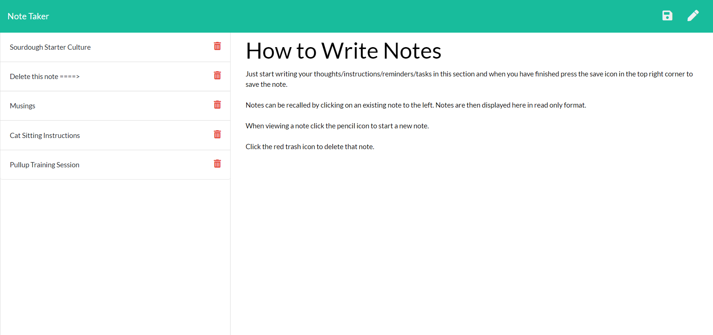

# Note Taker

   

## Description

A fully responsive Express.js web app hosted on heroku that allows users to create notes to help organise thoughts and planning. Notes are saved for review at a later date or can be deleted.

## Installation

1. Fork GitHub repo and clone to your chosen directory.
2. Follow the command lines to get started

- `npm install`
- `node index.js`

## Deployed Link

https://node-express-note-taker.herokuapp.com/

## Usage

Users simply enter a title and some text for their new note

1. Click the save icon to save the new note
2. Click on a saved note on the left to view the note again
3. Delete a note by clicking on the red bin icon
4. Start a new note by clicking the pencil icon

## Screenshot

